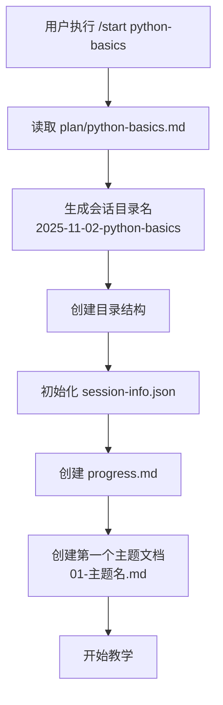
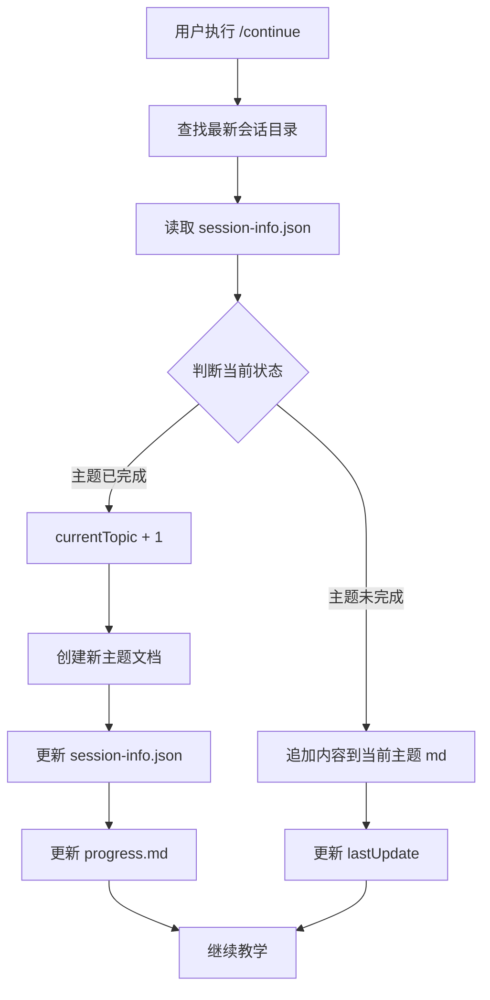

# 课程管理架构说明

> **版本**: 1.0
> **最后更新**: 2025-11-02

---

## 目录结构

```
MarkdownDocs/
├── .claude/
│   └── commands/
│       ├── start.md              # 开始课程命令
│       ├── continue.md           # 继续课程命令
│       ├── plan.md               # 规划课程命令
│       ├── test.md               # 测试命令
│       └── .templates/           # 模板目录
│           ├── progress-template.md
│           └── session-info-schema.json
├── plan/                         # 课程计划目录
│   ├── python-basics.md
│   ├── web-development.md
│   └── ...
└── topic/                        # 课程会话目录
    ├── 2025-11-02-python-basics/
    │   ├── session-info.json
    │   ├── progress.md
    │   ├── 01-变量与类型.md
    │   ├── 02-控制流.md
    │   └── ...
    └── 2025-11-03-web-development/
        └── ...
```

---

## 工作流程

### 1. 开始课程: `/start <plan-name>`

**执行流程:**


**创建的文件:**
1. **`topic/{日期-课程名}/session-info.json`**
   - 记录课程元数据
   - 追踪当前进度
   - 维护主题列表

2. **`topic/{日期-课程名}/progress.md`**
   - 可视化进度追踪
   - 学习统计
   - 待复习列表

3. **`topic/{日期-课程名}/01-{主题名}.md`**
   - 第一个主题的课程内容
   - 由 AI 生成并维护

---

### 2. 继续课程: `/continue`

**执行流程:**


**更新的文件:**
- `session-info.json`: 更新进度和时间戳
- `progress.md`: 更新完成状态
- `{NN}-{主题名}.md`: 追加或创建内容

---

## 会话状态管理

### session-info.json 结构

```json
{
  "planName": "python-basics",
  "startDate": "2025-11-02",
  "sessionDir": "2025-11-02-python-basics",

  "currentTopic": 3,
  "totalTopics": 10,
  "completed": false,

  "topicList": [
    "变量与数据类型",
    "控制流程",
    "函数与模块",
    ...
  ],

  "topicStatus": {
    "1": {
      "name": "变量与数据类型",
      "status": "completed",
      "startTime": "2025-11-02T14:00:00Z",
      "endTime": "2025-11-02T14:30:00Z",
      "file": "01-变量与数据类型.md"
    },
    "2": {
      "name": "控制流程",
      "status": "completed",
      ...
    },
    "3": {
      "name": "函数与模块",
      "status": "in_progress",
      "startTime": "2025-11-02T15:00:00Z",
      "file": "03-函数与模块.md"
    }
  },

  "timestamps": {
    "created": "2025-11-02T14:00:00Z",
    "lastUpdate": "2025-11-02T15:00:00Z"
  }
}
```

### 状态字段说明

| 字段 | 类型 | 说明 |
|------|------|------|
| `planName` | string | 课程计划名称 |
| `currentTopic` | number | 当前正在学习的主题编号 (1-based) |
| `totalTopics` | number | 总主题数量 |
| `completed` | boolean | 课程是否完成 |
| `topicList` | array | 所有主题名称列表 |
| `topicStatus` | object | 每个主题的详细状态 |

---

## 文档命名规范

### 会话目录命名
- **格式**: `YYYY-MM-DD-{plan-name}`
- **示例**: `2025-11-02-python-basics`
- **说明**: 日期 + 课程计划名,便于排序和识别

### 主题文档命名
- **格式**: `{NN}-{主题名}.md`
- **示例**: `01-变量与类型.md`, `02-控制流.md`
- **说明**:
  - `NN`: 两位数字编号,从 01 开始
  - 主题名: 从课程计划中提取

---

## 命令协作关系

```
/plan <主题>
    ↓ 创建课程计划
    ↓ 保存到 plan/{主题}.md

/start <plan-name>
    ↓ 读取 plan/{plan-name}.md
    ↓ 创建会话目录结构
    ↓ 初始化状态文件
    ↓ 开始第一个主题

/continue
    ↓ 读取最新会话状态
    ↓ 判断继续或进入下一主题
    ↓ 更新文档和状态
    ↓ 继续教学

/test
    ↓ 读取当前主题
    ↓ 生成测验
    ↓ 记录成绩到 progress.md
```

---

## 设计原则

### 1. 分离关注点
- **plan/**: 课程计划 (只读,不变)
- **topic/**: 课程实例 (读写,动态)
- **.templates/**: 模板参考 (只读)

### 2. 可追溯性
- 每个会话独立目录
- 完整的时间戳记录
- 详细的进度追踪

### 3. 可恢复性
- 会话状态完整保存
- 支持中断后继续
- 多课程并行不冲突

### 4. 可读性
- Markdown 格式易读
- JSON 结构化数据
- 清晰的文件命名

---

## 错误处理

### 场景 1: plan 文件不存在
```
❌ 错误: 未找到课程计划 'xyz'
💡 提示:
- 执行 /plan xyz 创建新计划
- 或选择已有计划: python-basics, web-development
```

### 场景 2: 无活动会话
```
❌ 错误: 未找到活动课程会话
💡 提示: 使用 /start <plan-name> 开始新课程
```

### 场景 3: 会话目录冲突
```
⚠️ 警告: 今日已有同名课程会话
💡 选项:
1. 继续现有会话
2. 创建新会话 (添加时间后缀)
```

---

## 扩展性

### 未来功能
- [ ] 支持课程暂停/恢复
- [ ] 多学生会话管理
- [ ] 学习报告生成
- [ ] 课程导出/分享
- [ ] 测验历史分析

---

**文档维护**: 随架构更新保持同步
**参考命令**: `/start`, `/continue`, `/plan`
