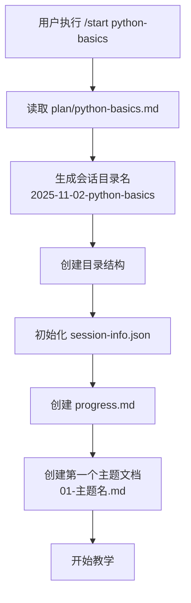
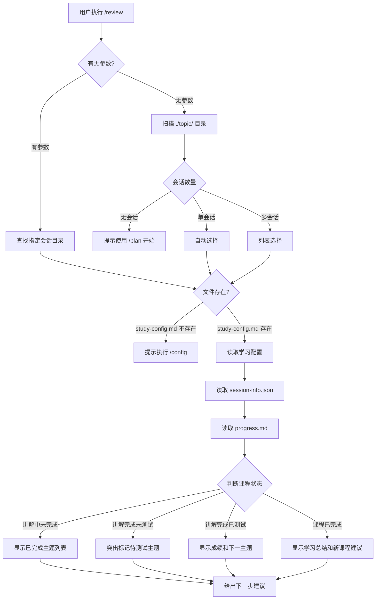
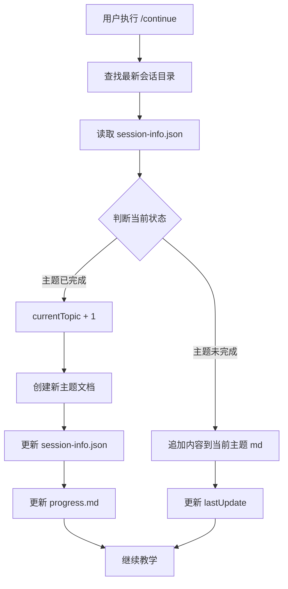
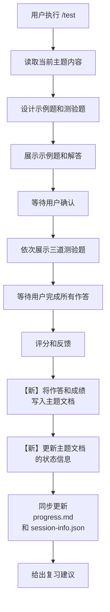

# 课程管理架构说明

> **版本**: 1.0
> **最后更新**: 2025-11-02

---

## 目录结构

```
study/
├── .claude/
│	└── .templates/               # 模板目录
│  	│   ├── workflow.md
│  	│   ├── progress-template.md
│   │   └── session-info-schema.json
│   └── commands/
│       ├── config.md             # 配置学习偏好命令
│       ├── plan.md               # 规划课程命令
│       ├── start.md              # 开始课程命令
│       ├── continue.md           # 继续课程命令
│       ├── review.md             # 学习进度回顾命令
│       └── test.md               # 测试命令
├── study-config.md               # 学习偏好配置（用户文件）
├── plan/                         # 课程计划目录
│   ├── python-basics.md
│   ├── web-development.md
│   └── ...
└── topic/                        # 课程会话目录
    ├── 2025-11-02-python-basics/
    │   ├── session-info.json
    │   ├── progress.md
    │   ├── 01-变量与类型.md
    │   ├── 02-控制流.md
    │   └── ...
    └── 2025-11-03-web-development/
        └── ...
```

---

## 命令说明

### 开始课程: `/start <plan-name>`

**执行流程:**



**创建的文件:**
1. **`topic/{日期-课程名}/session-info.json`**
   - 记录课程元数据
   - 追踪当前进度
   - 维护主题列表

2. **`topic/{日期-课程名}/progress.md`**
   - 可视化进度追踪
   - 学习统计
   - 待复习列表

3. **`topic/{日期-课程名}/01-{主题名}.md`**
   - 第一个主题的课程内容
   - 由 AI 生成并维护

---

### 学习进度回顾: `/review`

**执行流程:**


**输出内容:**
- 当前课程名称和进度百分比
- 已完成的主题列表
- 当前进行中的主题或待完成的主题
- 测试分数（如有）
- 下一步行动建议（/continue 或 /test）

---

### 继续课程: `/continue`

**执行流程:**


**更新的文件:**
- `session-info.json`: 更新进度和时间戳
- `progress.md`: 更新完成状态
- `{NN}-{主题名}.md`: 追加或创建内容

---

### 测试理解: `/test`

**执行流程:**


**数据持久化（H1-I 步骤）:**

1️⃣ **H1: 写入主题文档**
   - 在主题文档末尾添加"📋 测验记录"部分
   - 包含：测验时间、成绩、每道题的学生答案和标准答案、答题状态
   - 若已存在测验记录，则**更新（replace）**而不是追加

2️⃣ **H2: 更新主题文档状态**
   - 添加"文档状态"标记：`in_progress` → `completed` → `tested` / `need_retry`
   - `tested`: 成绩 ≥ 及格线（默认60分）
   - `need_retry`: 成绩 < 及格线

3️⃣ **I: 同步三文件**（原子操作顺序）
   - ① 更新 `session-info.json`：`topicStatus[当前主题]` 添加 `testResult` 字段
   - ② 更新 `progress.md`：在进度表中记录该主题的成绩和状态
   - ③ 更新时间戳：`lastUpdate` 记录本次测验的时间

**记录的信息:**
- 测试分数和评价
- 答题情况和反馈
- 每道题的学生答案和标准答案对比
- 需要复习的知识点
- 错误分类（概念/计算/应用）

---

## 会话状态管理

### session-info.json 结构

```json
{
  "planName": "python-basics",
  "startDate": "2025-11-02",
  "sessionDir": "2025-11-02-python-basics",

  "currentTopic": 3,
  "totalTopics": 10,
  "completed": false,

  "topicList": [
    "变量与数据类型",
    "控制流程",
    "函数与模块",
    ...
  ],

  "topicStatus": {
    "1": {
      "name": "变量与数据类型",
      "status": "tested",
      "startTime": "2025-11-02T14:00:00Z",
      "endTime": "2025-11-02T14:30:00Z",
      "file": "01-变量与数据类型.md",
      "testResult": {
        "testTime": "2025-11-02T14:30:00Z",
        "score": 85,
        "maxScore": 100,
        "passThreshold": 60,
        "isPassed": true,
        "questions": [
          {
            "id": 1,
            "difficulty": "easy",
            "correct": true,
            "studentAnswer": "[学生答案]",
            "correctAnswer": "[标准答案]"
          }
        ]
      }
    },
    "2": {
      "name": "控制流程",
      "status": "completed",
      "startTime": "2025-11-02T14:30:00Z",
      "endTime": "2025-11-02T15:00:00Z",
      "file": "02-控制流程.md"
    },
    "3": {
      "name": "函数与模块",
      "status": "in_progress",
      "startTime": "2025-11-02T15:00:00Z",
      "file": "03-函数与模块.md"
    }
  },

  "timestamps": {
    "created": "2025-11-02T14:00:00Z",
    "lastUpdate": "2025-11-02T15:00:00Z"
  }
}
```

### 状态字段说明

| 字段 | 类型 | 说明 |
|------|------|------|
| `planName` | string | 课程计划名称 |
| `currentTopic` | number | 当前正在学习的主题编号 (1-based) |
| `totalTopics` | number | 总主题数量 |
| `completed` | boolean | 课程是否完成 |
| `topicList` | array | 所有主题名称列表 |
| `topicStatus` | object | 每个主题的详细状态 |

### 主题状态（status）说明

| 状态值 | 说明 | 转换规则 |
|--------|------|---------|
| `in_progress` | 正在学习中（讲解未完成） | `/continue` 完成讲解后转为 `completed` |
| `completed` | 讲解内容完成，待测试 | `/test` 测试后根据成绩转为 `tested` 或 `need_retry` |
| `tested` | 已测试且成绩 ≥ 及格线（默认60分） | 支持 `/test` 重考 |
| `need_retry` | 已测试但成绩 < 及格线，需要复习后重考 | 建议先 `/continue` 复习再 `/test` 重考 |

### testResult 字段说明（在主题被测试后添加）

| 字段 | 类型 | 说明 |
|------|------|------|
| `testTime` | string | ISO 8601 时间戳，测试执行的时间 |
| `score` | number | 学生取得的分数 |
| `maxScore` | number | 测试的满分 |
| `passThreshold` | number | 及格线（默认60分） |
| `isPassed` | boolean | 是否及格（score ≥ passThreshold） |
| `questions` | array | 每道题的详细答题信息 |

### 题目对象（questions 数组中的元素）

| 字段 | 类型 | 说明 |
|------|------|------|
| `id` | number | 题目序号（1, 2, 3） |
| `difficulty` | string | 难度等级：`easy`(3/10) / `medium`(6/10) / `hard`(9/10) |
| `correct` | boolean | 是否答对 |
| `studentAnswer` | string | 学生的答案 |
| `correctAnswer` | string | 标准答案 |
| `errorType` | string | 错误分类（仅当 correct=false）：`conceptual`(概念) / `calculation`(计算) / `application`(应用) |

---

## 主题讲解完成的判断标准

### 定义

一个主题的**讲解完成**需要同时满足以下三个条件：

#### 1️⃣ 状态条件（session-info.json）
```json
topicStatus[N].status !== "in_progress"
AND
topicStatus[N].completedAt !== null
```

#### 2️⃣ 文件条件（主题文档）
- 文件 `{NN}-{主题名}.md` 存在
- 文件内容不为空（至少包含标题和正文）

#### 3️⃣ 时间条件（主题文档末尾）
主题文档末尾包含完成标记：
```markdown
---

## 📝 讲解完成标记

- 完成时间：2025-11-02 15:30:00
- 状态：讲解完成，准备测试或继续
```
或简单形式：`<!-- completedAt: 2025-11-02T15:30:00Z -->` 注释

### completedAt 字段说明

| 字段 | 值类型 | 说明 |
|------|--------|------|
| `completedAt` | `null` | 讲解中，尚未标记完成 |
| `completedAt` | ISO 8601时间戳 | 讲解已完成，该时间戳标记完成时刻 |

---

## 文档命名规范

### 会话目录命名
- **格式**: `YYYY-MM-DD-{plan-name}`
- **示例**: `2025-11-02-python-basics`
- **说明**: 日期 + 课程计划名,便于排序和识别

### 主题文档命名
- **格式**: `{NN}-{主题名}.md`
- **示例**: `01-变量与类型.md`, `02-控制流.md`
- **说明**:
  - `NN`: 两位数字编号,从 01 开始
  - 主题名: 从课程计划中提取

---

## 命令协作关系

```
/plan <主题>
    ↓ 创建课程计划
    ↓ 保存到 plan/{主题}.md

/start <plan-name>
    ↓ 读取 plan/{plan-name}.md
    ↓ 创建会话目录结构
    ↓ 初始化状态文件
    ↓ 开始第一个主题

/continue
    ↓ 读取最新会话状态
    ↓ 判断继续或进入下一主题
    ↓ 更新文档和状态
    ↓ 继续教学

/test
    ↓ 读取当前主题
    ↓ 生成测验
    ↓ 记录成绩到 progress.md
```

---

## 设计原则

### 1. 分离关注点
- **plan/**: 课程计划 (只读,不变)
- **topic/**: 课程实例 (读写,动态)
- **.templates/**: 模板参考 (只读)

### 2. 可追溯性
- 每个会话独立目录
- 完整的时间戳记录
- 详细的进度追踪

### 3. 可恢复性
- 会话状态完整保存
- 支持中断后继续
- 多课程并行不冲突

### 4. 可读性
- Markdown 格式易读
- JSON 结构化数据
- 清晰的文件命名

---

## 扩展性

### 未来功能
- [ ] 支持课程暂停/恢复
- [ ] 多学生会话管理
- [ ] 学习报告生成
- [ ] 课程导出/分享
- [ ] 测验历史分析

---

**文档维护**: 随架构更新保持同步
